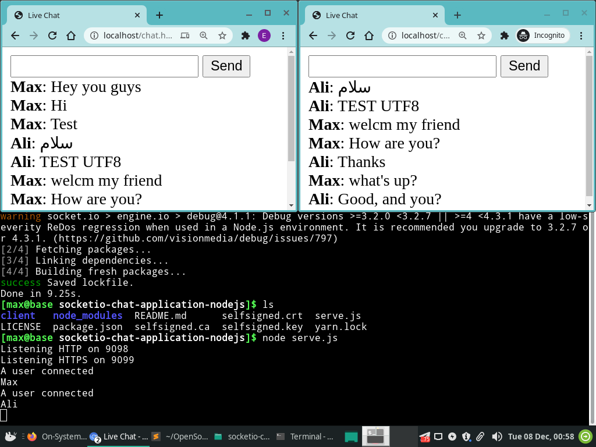

# Socket.IO Chat Application Nodejs

WebSocket **Chat** asynchronous communication application for online live concert. (Nodejs)



## Features

- Live Websocket (socketio)
- Asynchronous communication (nodejs)
- Allow-Origin headers
- HTTP and HTTPS (WS and WSS socket)
- Self-signed certificate
- Support UTF-8 (Arabic, Persian, etc)
- Some options (reconnection attempt, timeout, reject)

### Install dependencies

Easily install all:
```
yarn install
```

or manualy:

```
npm install fs
npm install http
npm install https
npm install socket.io
```

You can also install dependencies with the help of Yarn:

```
yarn add fs
yarn add http
yarn add https
yarn add socket.io
```

### Start and serve server socket

Move client files into Web-Server root directory:

```
cd client/
mv index.html /usr/share/nginx/html/
mv script.html /usr/share/nginx/html/
```

Start server-side socket:

```
cd server/
node serve.js 
```

## The purpose of this project

We needed to implement a **chat service** in the shortest time. Because **Mehrad Hidden concert** was going to be held soon and the band **RadLive** needed to have this platform without any problems or violations.

Therefore, thousands of people needed to be able to use this chat at the same time.
https://radlive.me/

### Concert Team

- Artist: [Mehrad Hidden](https://www.instagram.com/mehradhiddenofficial/)
- Guest Artist: [aslekaar](https://www.instagram.com/aslekaar)
- Producer: [guitariran](https://www.instagram.com/guitariran)
- Executive Producer: [Jafari.Hr](https://www.instagram.com/Jafari.Hr)
- Director and production manager : [heenofficial](https://www.instagram.com/heenofficial)

Band:

- [Nimaramezan](https://www.instagram.com/nimaramezan)
- [Arash Saeedi](https://www.instagram.com/arashsaeediofficial)
- [Borna Shafizadeh](https://www.instagram.com/borna_shafizadeh)
- [heenofficial](https://www.instagram.com/heenofficial)
- [Parsa Hadi](https://www.instagram.com/parsahadi.cellist)

Background Sercices:

- IT Manager : [Hamed Gharagozlou](https://www.instagram.com/hawmedgh)
- Help, Tech Leader : [Max Base](https://www.instagram.com/max.base)
- Photography Director: [Soroosh Oliaei](https://www.instagram.com/soroosholiaei)
- Graphic Designer: [Navid Sedaghati Monavar](https://www.instagram.com/Naviiiiid)
- Lighting: [Amir Nashvi](https://www.instagram.com/khashayar_97)

---------

# Max Base

My nickname is Max, Programming language developer, Full-stack programmer. I love computer scientists, researchers, and compilers. ([Max Base](https://maxbase.org/))

## Asrez Team

A team includes some programmer, developer, designer, researcher(s) especially Max Base.

[Asrez Team](https://www.asrez.com/)
